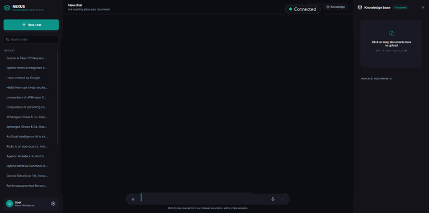
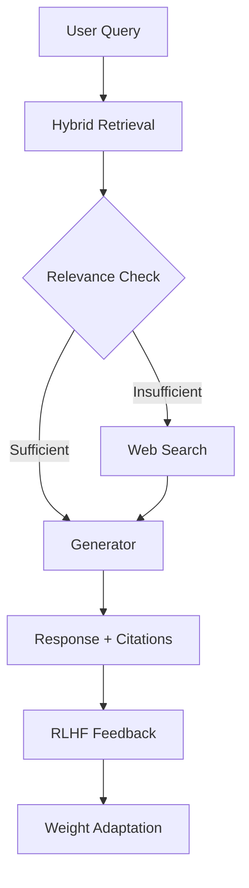

<!-- Banner / Logo -->
<div align="center">
  <h1>NEXUS</h1>
  <p>Agentic Corrective RAG with Hybrid Retrieval & RLHF</p>

  <!-- Badges -->
  [](https://fastapi.tiangolo.com/)
  [](https://github.com/langchain-ai/langgraph)
  [](https://www.trychroma.com/)
  [](https://www.python.org/)
  [](https://opensource.org/licenses/MIT)
  [](https://github.com/Josh7sam/Nexus/actions/workflows/ci.yml)

  
</div>

---

## What is NEXUS?
NEXUS is an Agentic Corrective RAG engine that combines dense vector search (ChromaDB) with sparse lexical retrieval (BM25), fused via Reciprocal Rank Fusion (RRF). An agentic LangGraph pipeline evaluates retrieval quality at runtime and triggers corrective web search when document relevance is insufficient. RLHF feedback loops adapt retrieval weights over time.

## Architecture


## Retrieval Pipeline
- **Dense**: ChromaDB with sentence-transformers embeddings (`text-embedding-004`).
- **Sparse**: BM25 via `rank_bm25` library.
- **Fusion**: Reciprocal Rank Fusion (RRF) with constant parameter $k=60$.
- **Corrective**: Triggered automatically when retrieval relevance score is below the minimum threshold.

## Performance
Performance benchmarking in progress. Results will be published in v0.2.0.

## Quick Start
```bash
git clone https://github.com/Josh7sam/Nexus.git
cd Nexus
cp .env.example .env
pip install -r requirements.txt
python main.py
```

## Environment Variables
| Variable          | Description              | Required |
|-------------------|--------------------------|----------|
| GEMINI_API_KEY    | Google Gemini API key    | Yes      |
| CHROMA_HOST       | ChromaDB host            | No       |
| DEBUG             | Enable debug mode        | No       |

## Tech Stack
| Layer      | Technology              |
|------------|-------------------------|
| Backend    | FastAPI, Python 3.11+   |
| RAG Engine | LangGraph, LangChain    |
| Vector DB  | ChromaDB                |
| Sparse     | BM25 (rank_bm25)        |
| LLM        | Google Gemini 2.5       |
| Frontend   | Vanilla JS, HTML, CSS   |
| Tests      | pytest                  |

## License
MIT
